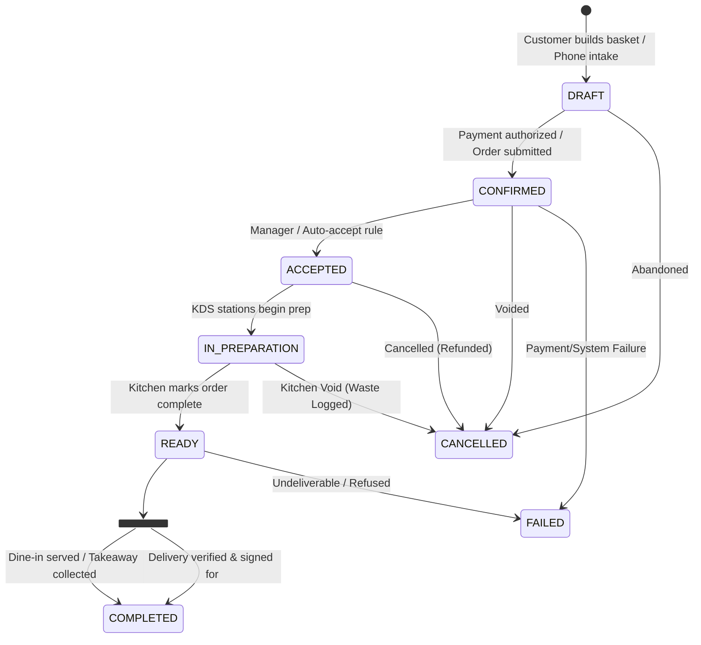
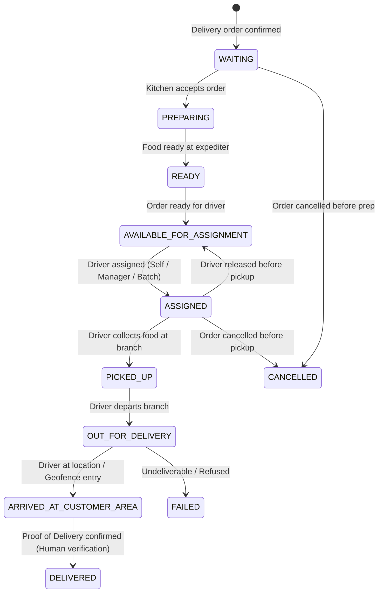

# RestaurantOS — Master Architectural Blueprint

**Document ID:** `DOC-ARCH-001`  
**Version:** `1.1.0`  
**Status:** Approved Canonical Blueprint  
**Author:** Lead Enterprise Architect  

---

## 1. System Vision & Architecture Overview

**RestaurantOS** is designed as a modular, event-driven, multi-tenant operating system capable of powering single-location artisanal restaurants up to enterprise multi-national dining chains with hundreds of branches.

The system is structured as a **Clean Architecture / Modular Monolith** with strict domain boundaries, preparing for seamless microservice extraction if scale demands, while maintaining low operational overhead and ultra-fast transaction performance in Generation 1.

```mermaid
graph TD
    subgraph Client Surfaces [Client Interaction Layer]
        WebOrdering[Public Web / SEO Portal]
        Kiosk[Self-Service Kiosk]
        POS[Point of Sale Terminal]
        Telephony[Telephony & Caller ID Popup]
        KDS[KDS Kitchen Rail]
        Dispatch[Manager Dispatch Console]
        DriverApp[Driver Mobile Web App]
        AdminPortal[HQ Enterprise Backoffice]
    end

    subgraph Edge & Security [Edge & Gateway Layer]
        Cloudflare[Cloudflare CDN / WAF / DDoS]
        APIGateway[API Gateway / Auth Middleware / Tenant Resolver / Rate Limiter]
    end

    subgraph Modular Monolith Backend [RestaurantOS Core Domain Plane]
        AuthModule[Auth & RBAC Domain]
        OrgModule[Org & Restaurant Hierarchy]
        MenuModule[Catalog & Modifiers Domain]
        OrderModule[Universal Order Engine & State Machine]
        KDSModule[KDS Station Routing Domain]
        DeliveryModule[Delivery & Driver Queue Engine]
        FleetModule[Vehicle & Tracker Fleet Domain]
        InventoryModule[Inventory & BOM Recipes Domain]
        MarketingModule[Loyalty, Promotions & CRM]
        IntegrationHub[Integration Hub & Adapters]
        EventBus[Typed Event Dispatcher & Outbox]
        AIInterface[Future Intelligence Scaffolding Layer]
    end

    subgraph Data & Storage [Data & Persistence Tier]
        Postgres[(PostgreSQL 16 Multi-Tenant DB + RLS)]
        RedisCache[(Redis 7 Cache / PubSub / Redlock)]
        S3Storage[(S3 / Cloud Object Storage)]
    end

    subgraph External Ecosystem [External Integrations]
        Aggregators[Wolt / 10bis / Mishloha]
        Invoicing[Green Invoice / Rivhit / iCount]
        Payments[Meshulam / Stripe / Credit Clearing]
        Communications[Twilio SMS / WhatsApp / SIP WebRTC]
        Trackers[IoT GPS / LTE Fleet Telematics]
    end

    Client Surfaces --> Edge & Security
    Edge & Security --> Modular Monolith Backend
    Modular Monolith Backend --> Data & Storage
    IntegrationHub <--> External Ecosystem
```

---

## 2. Domain-Driven Design (DDD) & Bounded Contexts

RestaurantOS organizes its core modules into 11 cohesive Bounded Contexts:

```mermaid
classDiagram
    class Identity_Access_Context {
        +Authentication
        +Users
        +Organizations
        +Restaurants
        +Branches
        +Roles
        +Permissions
        +Employees
    }

    class Customer_CRM_Context {
        +Customers
        +CustomerProfiles
        +Addresses
        +Allergies_Preferences
        +LoyaltyPoints
        +Campaigns
        +Promotions
        +Coupons
    }

    class Catalog_Menu_Context {
        +Categories
        +Products
        +Variants
        +ModifierGroups
        +Modifiers
        +BranchMenuOverrides
        +PricingSchedules
    }

    class Universal_Order_Context {
        +UniversalOrders
        +OrderItems
        +OrderModifiers
        +OrderStateEngine
        +Payments
        +BillingInvoices
    }

    class Kitchen_KDS_Context {
        +KDSTickets
        +StationRails
        +StationRouting
        +PreparationTimers
        +KitchenWorkloadEstimator
    }

    class Delivery_Logistics_Context {
        +Deliveries
        +DriverAvailabilityQueue
        +DriverProfiles
        +SmartBatchingEngine
        +DeliveryBatches
        +DispatchOverrides
        +GeoZones
    }

    class Fleet_Telematics_Context {
        +Vehicles
        +Trackers
        +DriverVehicleAssignments
        +VehicleTrackerAssignments
        +VehicleLocations
        +VehicleTrips
        +GeofenceEvents
    }

    class Inventory_SupplyChain_Context {
        +Warehouses
        +Suppliers
        +RawIngredients
        +Recipes_BOM
        +StockMovements
        +PurchaseOrders
        +WasteLogs
    }

    class Integration_Hub_Context {
        +ProviderAdapters
        +WoltAdapter
        +TenBisAdapter
        +MishlohaAdapter
        +InvoiceAdapters
        +PaymentAdapters
        +TrackerAdapters
        +TelephonySIPAdapter
    }

    class Analytics_Observability_Context {
        +AuditLogs
        +FinancialReports
        +OperationalMetrics
        +DeliveryTelemetry
        +FeatureFlagEvaluator
    }

    class Intelligence_Scaffolding_Context {
        +PredictionEngine
        +RecommendationEngine
        +DecisionEngine
        +LearningEngine
        +AutomationPolicyEngine
    }
```



---

## 3. Order Lifecycle vs Delivery Lifecycle Separation

A core architectural tenet of RestaurantOS is the strict separation between the **Universal Order lifecycle** (customer purchase & kitchen fulfillment) and the **Delivery lifecycle** (transportation & fleet logistics).

### 3.1 Universal Order Lifecycle
Order status represents the lifecycle of the customer order itself and is completely decoupled from driver transit or vehicle motion.



### 3.2 Independent Delivery Lifecycle
The Delivery entity exists exclusively for orders requiring delivery transport. Non-delivery orders (Dine-in, Takeaway, Kiosk) never instantiate a `Delivery` entity.



---

## 4. Multidimensional Driver State Model & Availability Queue

Driver status is structured across three distinct, orthogonal dimensions:

1. **Shift Status:** `OFF_SHIFT`, `ON_SHIFT`, `BREAK`
2. **Assignment Status:** `AVAILABLE`, `ASSIGNED`
3. **Trip Status:** `NOT_STARTED`, `IN_TRANSIT`, `AT_CUSTOMER`, `RETURNING`

### 4.1 Canonical Driver Availability Queue
- Queue ordering is strictly deterministic: `available_since ASC`.
- Queue position is a **derived projection**, never stored as a static column.
- Timestamp updates for `available_since`:
  - Clock-in (`POST /drivers/me/clock-in`) $\rightarrow$ sets `available_since = NOW()`.
  - Return from Break (`DriverReturnedFromBreak`) $\rightarrow$ sets `available_since = NOW()` (joins tail of FIFO queue).
  - Physical Return to Restaurant (`DriverReturnedToRestaurant`) $\rightarrow$ sets `available_since = NOW()` (joins tail of FIFO queue).
  - Released Assignment $\rightarrow$ retains original or resets `available_since` based on branch policy.

---

## 5. Fleet Tracking & Telematics Hierarchy

The system models vehicles and telematics devices as first-class domain entities:

$$\text{Driver} \xrightarrow[\text{Temporal Assignment}]{\text{DriverVehicleAssignment}} \text{Vehicle} \xrightarrow[\text{Temporal Assignment}]{\text{VehicleTrackerAssignment}} \text{Tracker} \xrightarrow{\text{Telemetry}} \text{VehicleLocation} \xrightarrow{\text{Spatial Event}} \text{GeofenceEvent} \xrightarrow{\text{Accumulation}} \text{VehicleTrip} \xrightarrow{\text{Association}} \text{Delivery}$$

### 5.1 Telemetry $\neq$ Business Truth Principle
- Inbound GPS telemetry entering a customer geofence emits `VehicleEnteredCustomerGeofence` and may update the delivery state to `ARRIVED_AT_CUSTOMER_AREA`.
- GPS telemetry **NEVER** automatically completes a delivery as `DELIVERED`.
- In Generation 1, delivery completion requires explicit human verification (driver confirmation with optional photo/signature Proof of Delivery).

---

## 6. Kitchen Display System (KDS) & SLA Visual Model

### 6.1 KDS Lifecycle
The KDS lifecycle describes food cooking progress, completely decoupled from driver logistics:
$$\text{QUEUED} \longrightarrow \text{STARTED} \longrightarrow \text{READY} \longrightarrow \text{BUMPED} \quad (\text{Optional: } \text{RECALLED})$$

### 6.2 KDS SLA Visual Thresholds
- **NORMAL:** Green / Neutral timer badge (Elapsed time $< 70\%$ of target prep time).
- **NEAR_SLA:** Amber warning badge (Elapsed time between $70\%$ and $100\%$ of target prep time).
- **SLA_EXCEEDED:** High-contrast full red ticket header, bold white text, large elapsed timer (e.g. `+00:37`), warning icon, subtle pulse, designed for instant legibility from 1.5–2 meters.

---

## 7. Inventory Depletion Policy

RestaurantOS supports a configurable business policy for inventory depletion:
- **`ON_ACCEPTED` (Default):** Depletes ingredient stock immediately upon order acceptance (prevents overselling during busy shifts).
- **`ON_PREPARATION_START`:** Depletes stock when KDS station begins cooking.
- **`ON_FULFILLMENT`:** Depletes stock when order transitions to `COMPLETED`.

---

## 8. Real-Time Streaming & Ticket-Based WebSocket Security

To prevent leaking long-lived tokens in query strings or server logs, WebSockets enforce short-lived connection tickets:

1. Client requests a ticket via authenticated HTTP: `POST /api/v1/realtime/ticket`.
2. Server validates user/session permissions and issues an ephemeral, single-use, 60-second ticket token bound to specific tenant and branch channels.
3. Client establishes WebSocket: `wss://api.restaurantos.io/api/v1/realtime?ticket=<ephemeral_ticket>`.
4. Channels are strictly isolated:
   - `branch:<id>:kds:<station>` (Line cooks, Kitchen managers)
   - `branch:<id>:dispatch` (Dispatch managers, GMs)
   - `driver:<id>:deliveries` (Restricted driver updates)
   - `order:<id>:tracking` (Public anonymized customer tracking)
   - `branch:<id>:telemetry` (Fleet managers, restricted raw GPS stream)
