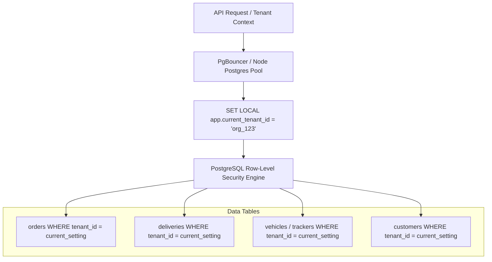

# RestaurantOS — Master Database Architecture & Isolation Strategy

**Document ID:** `DOC-DB-001`  
**Version:** `1.1.0`  
**Status:** Approved Canonical Database Architecture  
**Target Engine:** PostgreSQL 16+ with PostGIS / GiST Spatial Extension  

---

## 1. Database Topology & Multi-Tenancy Architecture

RestaurantOS utilizes a **Shared Database / Shared Schema with Row-Level Security (RLS)** architecture. This provides the optimal balance of cloud resource efficiency, cross-brand analytics aggregation, schema migration simplicity, and mathematical data isolation between competing tenants.



---

## 2. Multi-Tenancy Row-Level Security (RLS) Implementation

Every tenant-scoped table enforces PostgreSQL RLS policies. The application sets the tenant session variable upon checking out a database connection:

```sql
-- Set during transaction initialization
SET LOCAL app.current_tenant_id = 'org_uuid_here';
SET LOCAL app.current_branch_id = 'branch_uuid_here';

-- Restrictive RLS Policy Example
ALTER TABLE orders ENABLE ROW LEVEL SECURITY;

CREATE POLICY tenant_isolation_policy ON orders
  AS RESTRICTIVE
  USING (tenant_id = NULLIF(current_setting('app.current_tenant_id', true), '')::uuid)
  WITH CHECK (tenant_id = NULLIF(current_setting('app.current_tenant_id', true), '')::uuid);
```

### 2.1 Multi-Tenant Cross-Referencing Integrity Rules
A Delivery belonging to Tenant A must never reference a Driver, Vehicle, Tracker, or Branch belonging to Tenant B:
- Composite foreign keys and explicit foreign key constraints across `(tenant_id, id)` ensure absolute integrity.
- Application repository layers enforce multi-tenant assertions prior to database transaction execution.

---

## 3. High-Volume Telemetry Retention & Partitioning Strategy

High-frequency GPS telemetry packets from vehicle IoT trackers can produce millions of records daily.

### 3.1 Range Partitioning for `vehicle_locations`
The `vehicle_locations` table is partitioned by month using PostgreSQL declarative range partitioning:
```sql
CREATE TABLE vehicle_locations (
    id UUID NOT NULL DEFAULT gen_random_uuid(),
    tenant_id UUID NOT NULL,
    branch_id UUID NOT NULL,
    vehicle_id UUID NOT NULL,
    tracker_id UUID NOT NULL,
    latitude NUMERIC(10, 7) NOT NULL,
    longitude NUMERIC(10, 7) NOT NULL,
    speed_kmh NUMERIC(5, 2),
    heading_degrees NUMERIC(5, 2),
    accuracy_meters NUMERIC(5, 2),
    battery_level NUMERIC(4, 1),
    recorded_at TIMESTAMPTZ NOT NULL,
    received_at TIMESTAMPTZ NOT NULL DEFAULT NOW(),
    PRIMARY KEY (id, recorded_at)
) PARTITION BY RANGE (recorded_at);
```

### 3.2 Automated Rolling Data Lifecycle
1. **Raw Pings (30-Day Retention):** Unsummarized GPS pings older than 30 days are automatically dropped via cron partition rotation.
2. **Aggregated Trips (`vehicle_trips`):** Key trip telemetry (start time, end time, total distance, average speed, route path summary, and associated delivery ID) is permanently stored in `vehicle_trips` for historical reporting and auditability.

---

## 4. Indexing & Spatial Optimization Strategy

1. **Composite Tenant-Branch Indexes:**
   ```sql
   CREATE INDEX idx_orders_tenant_branch_status ON orders (tenant_id, branch_id, status, created_at DESC) WHERE deleted_at IS NULL;
   CREATE INDEX idx_deliveries_tenant_branch_status ON deliveries (tenant_id, branch_id, status, created_at DESC) WHERE deleted_at IS NULL;
   ```
2. **Spatial GiST Indexes for Delivery Polygons & Locations:**
   ```sql
   CREATE INDEX idx_delivery_zones_polygon ON delivery_zones USING GIST (boundary_polygon) WHERE deleted_at IS NULL;
   CREATE INDEX idx_customer_addresses_geo ON customer_addresses USING GIST (location_point) WHERE deleted_at IS NULL;
   ```
3. **GIN Indexes for JSONB Metadata & Decision Scoring:**
   ```sql
   CREATE INDEX idx_decision_logs_gin ON intelligence_decision_logs USING GIN (candidate_inputs, recommended_output);
   CREATE INDEX idx_audit_logs_diff_gin ON audit_logs USING GIN (state_diff);
   ```
