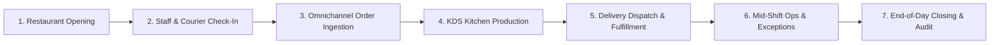
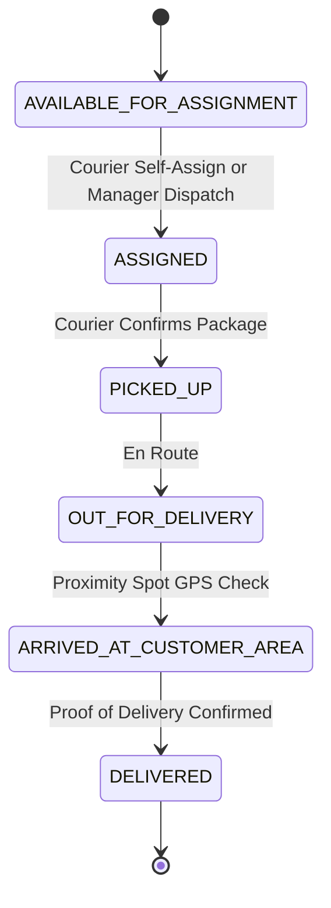

# RestaurantOS — Master End-to-End Operational Guide

**Document ID:** `DOC-OPS-GUIDE-001`  
**Version:** `1.0.0`  
**Target Audience:** Restaurant General Managers, Kitchen Supervisors, Shift Leads, Dispatchers, Couriers, and Operations Engineers  
**System Scope:** Universal Web Platform, Manager Android App, Driver Android App, Kitchen Display System (KDS), Public Web Ordering, and POS/Kiosk  

---

## 🧭 Document Purpose & Operational Philosophy

RestaurantOS is an enterprise-grade, human-operated (Generation 1) operating system for multi-channel restaurant logistics. This document provides a complete, sequential, step-by-step operational guide describing exactly how the system runs throughout a business day—from pre-shift opening to post-shift closing.



---

## 🏛️ System Interfaces & User Roles

| Interface / Surface | Primary Users | Primary Operations |
| :--- | :--- | :--- |
| **Web Management Portal** | Owners, Area Managers, General Managers | Tenant config, branch settings, menus, pricing, BOM recipes, CRM, reporting |
| **Manager Android App** (`apps/manager-android`) | Shift Managers, Expeditors, Floor Leads | Live dashboard, branch switching, manual order creation, dispatch, KDS monitoring |
| **Kitchen Display System (KDS)** | Line Cooks, Station Chefs, Expeditors (Expo) | Station digital ticket rails, ticket bumping, recipe view, aging alerts |
| **Driver Android App** (`apps/driver-android`) | Delivery Couriers, Fleet Drivers | Shift clock-in, FIFO queue, delivery self-assignment, Waze/Maps deep-linking, spot GPS |
| **Public Web & Kiosk** | Customers | Menu browsing, modifier customization, cart, promo codes, payments, live order tracker |

---

## Phase 1: Pre-Shift & Restaurant Opening (Morning Setup)

### Step 1.1: System Health & Infrastructure Verification
1. Shift Manager opens the **Manager Android App** or browser dashboard.
2. Verify system connectivity indicator:
   - Green indicator confirms database, Redis pub/sub, and real-time SSE streams are active (`/health/ready`).
   - If an orange or red banner appears, consult the [Offline Resilience Runbook](file:///f:/Developing/Web/ShorTech/RestaurantOS/docs/OPERATIONS.md#runbook-1-kds-station-disconnection-or-kitchen-tablet-offline).

### Step 1.2: Branch & Channel Opening
1. In the Manager App, navigate to **Settings** $\rightarrow$ **Active Branch**.
2. Tap **Open Restaurant for Orders**:
   - This sets `is_accepting_orders: true` for the active branch.
   - Automatically enables the branch across the Public Website, In-Store Kiosks, and Aggregator integrations (Wolt, 10bis).
3. Set estimated kitchen prep time (e.g., standard 15 min, peak 30 min).

### Step 1.3: Menu & 86'd Items Verification
1. Navigate to **Catalog / Menu Management**.
2. Review the active daily menu and pricing.
3. Conduct physical inventory inspection of perishable ingredients (e.g. fresh buns, salmon, avocado).
4. If an ingredient is unavailable, toggle the **86 Item** switch on that product or modifier:
   - The item is immediately marked unavailable across **all channels simultaneously** (Web, Kiosk, POS, Wolt, 10bis).

### Step 1.4: Kitchen Stations Boot & KDS Rails Initialization
1. Power on the kitchen display tablets at designated stations:
   - **Station 1: Grill** (Burgers, Steaks, Grilled Chicken)
   - **Station 2: Fryer** (Chips, Onion Rings, Wings)
   - **Station 3: Cold / Assembly** (Salads, Desserts, Drink Dispensers)
   - **Station 4: Expeditor / Expo** (Packaging, Final Bagging, Quality Control)
2. Tap **Launch KDS Station** on each tablet and select the corresponding station filter.
3. Verify the digital ticket rail is clear and listening for real-time order events via WebSockets / SSE.

### Step 1.5: Cash Drawer Opening & Float Registration
1. On the POS terminal, navigate to **Cash Management** $\rightarrow$ **Open Shift Float**.
2. Count and enter the physical starting cash float (e.g., ₪500).
3. Tap **Confirm Opening Float** to log the transaction in the financial audit trail.

---

## Phase 2: Staff & Courier Check-In

### Step 2.1: Kitchen & Floor Staff Clock-In
1. Kitchen and front-of-house staff clock in on the POS/Staff terminal using their 4-digit PIN.
2. System updates the labor tracking log for shift scheduling compliance.

### Step 2.2: Courier Authentication & Shift Clock-In
1. Couriers open the **Driver Android App** (`apps/driver-android`).
2. **First-Time / Logged-Out Couriers:**
   - Enter credentials: email + password.
   - Set up a 4-digit fast-unlock PIN.
3. **Returning Couriers:**
   - Enter the 4-digit PIN on the unlock screen (🔓 הזן קוד PIN) for fast, secure access.
4. On the Home Screen, tap **משמרת** $\rightarrow$ **התחל משמרת** (Clock In).
5. The system emits `DRIVER_CLOCKED_IN` and automatically places the courier into the **FIFO Driver Availability Queue** (`shift_status: ON_SHIFT`, `assignment_status: AVAILABLE`, `available_since: NOW()`).

### Step 2.3: Vehicle & Hardware GPS Tracker Assignment
1. If using company scooters, e-bikes, or cars, the shift manager in the Manager App assigns a vehicle to the courier (`POST /api/v1/fleet/assignments`).
2. Verify the hardware GPS tracker paired with the vehicle is broadcasting battery and location status (`/api/v1/fleet`).

---

## Phase 3: Omnichannel Order Capture & Ingestion

RestaurantOS ingests orders from multiple distinct customer channels into a unified **Universal Order Pipeline**:

```
[Public Website] ────────┐
[Self-Service Kiosk] ────┼──► [Universal Order Engine] ──► [KDS Station Splitting]
[Aggregators: Wolt/10bis] ┤     (DRAFT ➔ CONFIRMED)          (Grill, Fryer, Expo)
[Phone Orders (PBX)] ────┘
```

### Step 3.1: Online Customer Ordering (Public Web & Mobile)
1. Customer visits the restaurant web app, selects Delivery or Takeaway, and enters their street address.
2. Customer selects items, selects mandatory/optional modifiers (e.g., Meat Temperature: Medium Well, Add Bacon, No Pickles), and adds items to the cart.
3. Customer applies promo coupons or redeems loyalty reward points.
4. Customer completes payment via Credit Card (Stripe / Tranzila / Hyp) or selects Cash on Delivery.
5. System creates an order in `DRAFT` status, validates stock and pricing, captures payment authorization, and transitions the order to `CONFIRMED`.

### Step 3.2: Self-Service Kiosk & POS Orders
1. Customer uses in-store kiosk touch screen, browses rich categories, and completes credit card tap at the EMV terminal.
2. POS cashier enters counter orders directly into the Manager POS interface.

### Step 3.3: Phone Orders & Caller-ID PBX Recognition
1. Inbound telephone call rings on the restaurant PBX.
2. The Caller-ID webhook populates a popup on the POS showing:
   - Customer name and historical order count.
   - Saved delivery addresses and favorite orders.
3. Cashier taps **Reorder Favorite** or builds a new cart, then confirms the order.

### Step 3.4: Third-Party Delivery Aggregators (Wolt, 10bis, Mishloha)
1. Webhooks arrive at `/api/v1/integrations/aggregators/webhook`.
2. The Integration Hub validates HMAC signatures, normalizes provider items to restaurant catalog IDs, and injects the order into the Universal Order pipeline.

### Step 3.5: Automated Inventory Bill-of-Materials (BOM) Depletion
1. Upon transition to `CONFIRMED`, the inventory engine executes atomic recipe depletion:
   - Example: 1 "Bacon Cheeseburger" depletes 1 Bun, 200g Beef Patty, 20g Cheddar, 2 strips Bacon, 10g Sauce.
2. If stock drops below threshold, an in-app alert is pushed to the Shift Manager.

---

## Phase 4: Kitchen Preparation & KDS Operations

### Step 4.1: Line-Item Station Splitting
The Universal Order Engine splits the order items across designated KDS station screens:
- **Order #1042:**
  - `Grill Station:` 1x Double Beef Patty (Medium)
  - `Fryer Station:` 1x Large Fries
  - `Assembly Station:` 1x Caesar Salad, 1x Coca-Cola Zero
  - `Expo Station:` Complete Order Ticket #1042 overview

### Step 4.2: Digital Ticket Rail & Aging Thresholds
Tickets appear on the KDS in chronological order with visual aging indicators:
- 🟢 **Normal (0 - 8 mins):** Dark slate card with green header.
- 🟡 **Warning (8 - 15 mins):** Amber glowing border.
- 🔴 **Overdue (> 15 mins):** Pulsing red header, audio chime for priority escalation.

### Step 4.3: Station Cooking Bumps
1. Grill Chef cooks the patties $\rightarrow$ taps the item or uses bump-bar physical key $\rightarrow$ item strikes through on Grill KDS.
2. Fryer Chef drops and bags the fries $\rightarrow$ taps item on Fryer KDS $\rightarrow$ item strikes through.
3. When all line items for an order are bumped at prep stations, the **Expo Station** ticket turns bright cyan (**READY TO PACK**).

### Step 4.4: Expeditor (Expo) Station Consolidation & Packaging
1. Expo Packer checks order items against the ticket summary.
2. Places food in branded bags, attaches thermal printed order receipt with staples/stickers.
3. Expo taps **BUMP TICKET** on the Expo KDS:
   - Order lifecycle transitions from `IN_PREPARATION` $\rightarrow$ `READY`.
   - If Takeaway: Customer receives automated SMS: *"Your order #1042 is ready for pickup!"*
   - If Delivery: Delivery aggregate transitions to `AVAILABLE_FOR_ASSIGNMENT`.

---

## Phase 5: Delivery Dispatch, Route Management & Courier Fulfillment

RestaurantOS separates the **Order lifecycle** (food prep) from the **Delivery lifecycle** (transportation logistics):



### Step 5.1: Delivery Dispatch Modes

#### Mode A: Courier Self-Assignment (FIFO Queue)
1. Courier opens the **Driver App** and taps **תור משלוחים** (View Queue).
2. The screen shows all ready deliveries with order number, destination street, and notes.
3. Courier taps **קבל משלוח** (Self-Assign):
   - The backend runs an atomic transaction (`POST /api/v1/deliveries/:id/self-assign`).
   - If another courier claimed the order a millisecond earlier, the app handles the `409 Conflict` gracefully with a notice: *"Delivery already assigned"*, refreshing the queue without desyncing.
   - On success, delivery status transitions to `ASSIGNED`, and courier's status moves to `ASSIGNED`.

#### Mode B: Manager Dispatch & Smart Batching
1. Shift Manager opens **Manager App** $\rightarrow$ **Deliveries**.
2. Manager reviews algorithmic batch suggestions:
   - System clusters deliveries in the same geographic radius with similar ready times.
3. Manager taps **Assign to Courier** $\rightarrow$ selects courier from the top of the FIFO availability list.

### Step 5.2: Package Collection & Kitchen Departure
1. Courier walks to the delivery staging area, verifies Order # on the bag ticket.
2. In Driver App, courier taps **התחל משלוח** (Start) $\rightarrow$ status moves to `ASSIGNED`.
3. Courier collects bags $\rightarrow$ taps **איסוף בוצע** (Pickup Confirmed) $\rightarrow$ status moves to `PICKED_UP`.
4. Courier leaves the restaurant $\rightarrow$ status moves to `OUT_FOR_DELIVERY`.

### Step 5.3: Navigation & Customer Communication
1. On the Driver App active delivery card, courier taps **נווט** (Navigate):
   - Deep-links directly to **Waze** or **Google Maps** pre-populated with Hebrew street, building number, and city.
2. In case of gate codes or special instructions:
   - Card displays building code, floor, entrance, apartment number, and delivery notes.
   - Courier can tap **התקשר** (Call) to dial customer phone directly with privacy masking.

### Step 5.4: Arrival & Battery-Efficient Spot GPS Confirmation
1. As the courier arrives at the customer address, they tap **הגעתי ללקוח** (Arrived):
   - The Driver App requests a **single one-shot GPS fix** (`expo-location` with 8s timeout).
   - Telemetry fix is posted to `/api/v1/telemetry/location` as physical proof-of-proximity.
   - App does **not** drain battery with continuous background tracking.
   - Delivery status moves to `ARRIVED_AT_CUSTOMER_AREA`.

### Step 5.5: Handover, Proof of Delivery & Completion
1. Food handed over to customer (or left at door per customer notes).
2. Courier taps **השלם משלוח** (Complete Delivery) $\rightarrow$ confirms dialog:
   - Delivery status transitions to `DELIVERED`.
   - Universal Order transitions to `COMPLETED`.
   - Courier assignment status resets to `AVAILABLE`, trip status set to `RETURNING`.

### Step 5.6: Return to Restaurant & Queue Re-entry
1. Courier drives back to the branch.
2. Upon physical arrival, courier taps **הגעתי למסעדה** (Arrived at Restaurant):
   - Emits `DRIVER_RETURNED_TO_RESTAURANT`.
   - Courier rejoins the **FIFO availability queue** with `available_since: NOW()`, ready for their next dispatch.

---

## Phase 6: Mid-Shift Management & Exception Handling

### Step 6.1: Real-Time Operational Overview
Shift Managers monitor live KPIs on the Manager Android App dashboard:
- **Active Orders:** Breakdown by Dine-in, Takeaway, Delivery.
- **Average Kitchen Prep Time:** Rolling 30-minute average.
- **Active Couriers:** Number on-shift, available in queue, en route, or on break.
- **Revenue Today:** Net sales, average ticket value, cash vs. card breakdown.

### Step 6.2: Handling Delivery Releases & Courier Re-assignment
1. If a courier's vehicle breaks down or cannot fulfill an assigned delivery:
   - Courier or Manager taps **שחרר משלוח** (Release Delivery).
   - Delivery transitions back to `AVAILABLE_FOR_ASSIGNMENT`.
   - Re-enters queue for another courier to claim immediately.

### Step 6.3: Order Cancellations & Partial Refunds
1. If customer calls to cancel:
   - In Manager App, select order $\rightarrow$ tap **Cancel Order**.
   - Select reason (e.g. "Customer Request", "Kitchen Out of Stock").
   - If payment was processed, integration hub triggers automated refund via payment gateway adapter.
   - If food was already prepared, items are logged as **Kitchen Waste** with reason.

### Step 6.4: Courier Breaks & Queue Suspension
1. Courier requests break $\rightarrow$ taps **התחל הפסקה** (Break) in Driver App:
   - Courier is removed from the FIFO queue (`shift_status: BREAK`).
2. When break finishes, courier taps **חזור מהפסקה** (Return):
   - Rejoins at the back of the FIFO queue with `available_since = NOW()`.

### Step 6.5: Offline Network Drop Recovery
1. If restaurant Wi-Fi drops:
   - KDS and Manager App display persistent red **Offline Banner**.
   - Apps continue operating locally using cached state and offline action queues.
   - Upon network restoration, idempotent request queues automatically flush and reconcile with server.

---

## Phase 7: Inventory Tracking, Waste & Supply Chain

### Step 7.1: Mid-Day Waste & Spoilage Logging
1. If an ingredient is dropped, burned, or expired:
   - Staff opens **Inventory** $\rightarrow$ **Log Waste**.
   - Select ingredient, quantity (e.g., 2.5 kg Fries), reason code (`BURNED`, `DROPPED`, `EXPIRED`), and station.
   - Waste is subtracted from perpetual inventory and recorded in cost-of-goods accounting.

### Step 7.2: Supplier Receiving & Purchase Orders
1. When supplier delivers raw materials:
   - Manager navigates to **Purchasing** $\rightarrow$ selects pending Purchase Order.
   - Verifies invoice items and quantities received.
   - Taps **Receive Delivery** $\rightarrow$ stock levels instantly increment in warehouse inventory.

---

## Phase 8: Post-Shift & Restaurant Closing (End of Day)

```
[1. Kitchen Bump Clear] ➔ [2. Driver Clock-Outs] ➔ [3. Cash & POS Settlement] ➔ [4. Daily Count] ➔ [5. Close Branch]
```

### Step 8.1: Kitchen Shutdown & KDS Clearing
1. Expeditor verifies all orders on KDS rails are completed or cancelled.
2. Tap **Clear Station** on each KDS display.
3. Power down station tablets.

### Step 8.2: Courier Shift Clock-Out & Fleet Check-In
1. All couriers finish pending trips.
2. In Driver App, each courier taps **משמרת** $\rightarrow$ **סיים משמרת** (Clock Out):
   - Confirms clock-out modal dialog.
   - Removed from active driver availability registry.
3. Couriers park company vehicles, plug in e-bikes/scooters to chargers, and return vehicle keys.

### Step 8.3: Cash Drawer Reconciliation & End-of-Day Z-Report
1. Cashier / Manager opens **POS Cash Management** $\rightarrow$ **Close Shift Drawer**.
2. Count physical cash in drawer:
   - Enter counted 200, 100, 50, 20 bills and coins.
3. System calculates expected cash vs actual counted cash:
   - Computes variance (`over / short`).
4. Tap **Print & Commit Z-Report**:
   - Sends daily financial totals to fiscal printer / cloud invoice archive.
   - Closes daily financial register.

### Step 8.4: Daily Stock Count & Variance Audit
1. Floor manager conducts closing count of top 10 high-value items (Meats, Cheeses, Alcohol).
2. Enters physical counts into **Inventory** $\rightarrow$ **Daily Count Sheet**.
3. System outputs daily variance report comparing:
   $$\text{Expected Stock} = \text{Opening Stock} + \text{Received} - \text{BOM Sales Depletion} - \text{Logged Waste}$$
4. Discrepancies exceeding threshold trigger audit notifications for management review.

### Step 8.5: Branch Closing Across All Omnichannel Surfaces
1. In Manager App / Web Portal, navigate to **Active Branch**.
2. Tap **Close Restaurant for the Day**:
   - `is_accepting_orders: false`.
   - Public Website, Kiosks, and Aggregators immediately update to "Closed".
3. Manager taps **Log Out** to terminate active session.

---

## 🛠️ Developer & QA — Complete System Testing Guide

This section provides the complete step-by-step procedure to boot the **entire RestaurantOS system** locally for end-to-end testing, including the Next.js web platform, both Android mobile apps, the KDS kitchen display, and the live operational simulator.

### Prerequisites

Before starting, verify these tools are installed:

| Tool | Purpose | Install Command / Check |
|:---|:---|:---|
| **Node.js** ≥ 18.x | Runtime for Next.js and scripts | `node --version` |
| **npm** ≥ 9.x | Package manager | `npm --version` |
| **Expo CLI** | React Native mobile dev server | `npx expo --version` |
| **Android Studio** | Android emulator (optional) | Open Android Studio → AVD Manager |
| **tsx** | TypeScript script runner | `npx tsx --version` (auto-installed) |
| **PowerShell** 5.1+ | Automation scripts (Windows) | `$PSVersionTable.PSVersion` |

### Install Dependencies (First Time Only)

```powershell
# Root project (Next.js web + API)
cd f:\Developing\Web\ShorTech\RestaurantOS
npm install

# Manager Android App
cd apps\manager-android
npm install

# Driver Android App
cd ..\driver-android
npm install

# Return to root
cd ..\..
```

---

### Option A: 1-Click Full System Startup (Recommended)

The `start-all.ps1` script boots all system surfaces in parallel:

```powershell
# Web mode (default) — opens mobile apps in browser for fast testing
.\scripts\start-all.ps1

# Android emulator mode — requires Android Studio AVD running
.\scripts\start-all.ps1 -MobileTarget emulator

# QR code mode — scan with Expo Go on a physical Android phone
.\scripts\start-all.ps1 -MobileTarget qr

# Full system with live simulator attached
.\scripts\start-all.ps1 -WithSimulator
```

After running, the following surfaces will be available:

| Surface | URL / Access | Port |
|:---|:---|:---|
| 🌐 **Web Management Portal** | [http://localhost:3000](http://localhost:3000) | 3000 |
| 🍳 **Kitchen Display (KDS)** | [http://localhost:3000/kds/branch_dizengoff](http://localhost:3000/kds/branch_dizengoff) | 3000 |
| 📱 **Manager Android App** | [http://localhost:8081](http://localhost:8081) or Android emulator | 8081 |
| 🚗 **Driver Android App** | [http://localhost:8082](http://localhost:8082) or Android emulator | 8082 |

---

### Option B: Manual Step-by-Step Startup

If you prefer to start each surface individually (useful for debugging a specific surface):

**Terminal 1 — Next.js Web & API Server:**
```powershell
cd f:\Developing\Web\ShorTech\RestaurantOS
npm run dev
# → Web portal:  http://localhost:3000
# → KDS:         http://localhost:3000/kds/branch_dizengoff
# → API:         http://localhost:3000/api/v1/...
```

**Terminal 2 — Manager Android App:**
```powershell
cd f:\Developing\Web\ShorTech\RestaurantOS\apps\manager-android

# Web preview (fastest, no emulator needed)
npx expo start --web --port 8081

# OR: Android emulator (must have AVD running in Android Studio)
npx expo start --android

# OR: QR code for physical device with Expo Go
npx expo start
```

**Terminal 3 — Driver Android App:**
```powershell
cd f:\Developing\Web\ShorTech\RestaurantOS\apps\driver-android

# Web preview
npx expo start --web --port 8082

# OR: Android emulator
npx expo start --android

# OR: QR code
npx expo start
```

---

### Android Emulator Setup (Optional — For Native Testing)

To test on a real Android emulator instead of web preview:

1. **Open Android Studio** → Tools → Device Manager (AVD Manager)
2. **Create Virtual Device** if none exists:
   - Choose **Pixel 6** or **Pixel 7** hardware profile
   - Select a system image (API 33+ recommended)
   - Name it (e.g., `Pixel_6_API_33`)
3. **Launch the emulator** — click the green ▶ play button on the AVD
4. **Wait** until the emulator fully boots to the Android home screen
5. Run the mobile apps with `--android` flag:
   ```powershell
   # In Terminal 2
   cd apps\manager-android && npx expo start --android

   # In Terminal 3
   cd apps\driver-android && npx expo start --android
   ```
6. Expo will automatically install and launch the app on the running emulator

> **Tip:** You can run two emulators simultaneously for Manager + Driver by creating two AVDs in Android Studio and launching both before running the Expo commands.

---

### Running the Live System Simulator

The simulator executes a complete operational lifecycle through the real service layer — creating orders, routing to KDS, dispatching deliveries, and confirming proof of delivery.

```powershell
# Default speed (1x — real-time pacing)
npm run simulate:live

# Fast mode (5x speed — completes in ~15 seconds)
npx tsx scripts/simulate-live.ts --speed=5

# Slow mode for step-by-step observation
npx tsx scripts/simulate-live.ts --speed=0.5
```

**What the simulator does:**

| Step | Action | Surfaces Affected |
|:---|:---|:---|
| 1 | 3 couriers clock in to FIFO queue | Driver App, Manager Dashboard |
| 2 | 2 orders arrive (Web + Wolt webhook) | Web Portal, Manager App |
| 3 | KDS tickets created, cooking, and bumped | KDS Station Display |
| 4 | Courier self-assigns delivery from queue | Driver App, Dispatch Engine |
| 5 | GPS breadcrumbs along Dizengoff Street | Fleet Telemetry, Manager Map |
| 6 | Proof of delivery + courier returns to queue | Driver App, Order Lifecycle |
| 7 | Manager dashboard shows live metrics | Manager App Dashboard |

> **Important:** The simulator runs against the **in-memory database** and real service modules. The Next.js dev server (`npm run dev`) must be running first for SSE/WebSocket events to propagate to KDS and mobile app surfaces.

---

### Full System Test Checklist

Once all surfaces are running, validate these key flows:

```markdown
### 🧪 End-to-End Verification
- [ ] Web portal loads at http://localhost:3000
- [ ] KDS station rail loads at http://localhost:3000/kds/branch_dizengoff
- [ ] Manager app loads and shows Hebrew RTL layout
- [ ] Driver app loads and shows login/PIN screen
- [ ] Run `npm run simulate:live` and observe events across all surfaces
- [ ] Verify KDS tickets appear and can be bumped
- [ ] Verify delivery assignments in Manager dashboard
- [ ] Verify driver queue updates in real-time
- [ ] Check offline banner appears when network disconnects
- [ ] Confirm Hebrew text renders correctly (RTL direction)
```

---

### Troubleshooting

| Problem | Solution |
|:---|:---|
| `npm run dev` fails with port in use | Kill existing process: `npx kill-port 3000` |
| Expo says "Metro bundler not found" | Run `npm install` inside the specific app directory |
| Android emulator not detected | Ensure AVD is running in Android Studio before `expo start --android` |
| `@restaurantos/shared-mobile` import errors | Verify `metro.config.js` has correct `watchFolders` path |
| KDS not receiving live events | Ensure Next.js dev server is running on port 3000 |
| Simulator errors on missing modules | Run `npm install` in root, then `npm run dev` first |
| CORS errors in browser console | Mobile apps in web mode may need `--host` flag for cross-origin |

---

## 📋 Daily Operational Checklist (Quick Reference)

```markdown
### 🌅 Morning Opening Checklist
- [ ] Verify system connectivity (/health/ready green)
- [ ] Open Restaurant in Manager App (is_accepting_orders: true)
- [ ] Check 86'd items and adjust daily menu
- [ ] Boot all 4 KDS station tablets (Grill, Fryer, Assembly, Expo)
- [ ] Enter starting cash float in POS drawer
- [ ] Confirm first shift couriers clocked in & in FIFO queue

### 🏃 During Shift Checklist
- [ ] Monitor KDS aging alerts (bump tickets before red threshold)
- [ ] Review smart batch suggestions for multi-order deliveries
- [ ] Check courier status (ensure balanced availability in queue)
- [ ] Log kitchen waste immediately upon occurrence
- [ ] Monitor low-stock alerts for critical recipe ingredients

### 🌙 Nightly Closing Checklist
- [ ] Ensure all KDS tickets are bumped to COMPLETED
- [ ] Verify all couriers clocked out and vehicles checked in
- [ ] Perform cash drawer count & generate financial Z-Report
- [ ] Enter closing stock counts for high-value ingredients
- [ ] Tap "Close Restaurant" in Manager App
- [ ] Power down KDS tablets and secure premises
```
