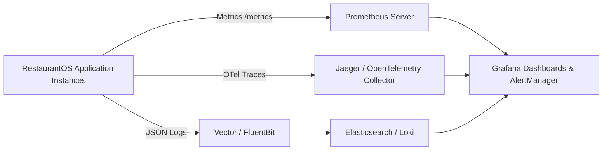

# RestaurantOS — Master Operations, Observability & Runbooks

**Document ID:** `DOC-OPS-001`  
**Version:** `1.0.0`  
**Status:** Approved Operational Blueprint  

---

## 1. Observability Stack & Telemetry

RestaurantOS implements the three pillars of observability: Metrics, Tracing, and Structured Logging.

### 1.1 Service Level Objectives (SLOs) & Alert Thresholds
| Metric Name | SLO Target | Warning Alert | Critical Pager Alert |
| :--- | :--- | :--- | :--- |
| **API Availability** | `99.95%` | Error rate `> 0.5%` for 2m | Error rate `> 2.0%` for 1m |
| **Order API Latency (p95)**| `< 150ms` | Latency `> 300ms` for 3m | Latency `> 1000ms` for 2m |
| **KDS Bump WebSocket Latency**| `< 50ms` | Latency `> 150ms` for 2m | Latency `> 500ms` for 1m |
| **Outbox Event Processing Lag**| `< 2 seconds` | Lag `> 10 seconds` for 3m | Lag `> 60 seconds` for 1m |
| **DB Connection Pool Usage**| `< 70%` | Usage `> 80%` for 5m | Usage `> 95%` for 2m |

---

## 2. Standard Health Probes

- **Liveness Probe (`GET /health/live`):** Returns `200 OK` if the Node.js process event loop is responsive.
- **Readiness Probe (`GET /health/ready`):** Returns `200 OK` only when:
  1. PostgreSQL connection pool is verified (`SELECT 1`).
  2. Redis cache and Pub/Sub connection is active (`PING -> PONG`).
  3. Pending database migrations are applied.
- **Startup Probe (`GET /health/startup`):** Allows up to 60 seconds for initial container initialization and cache warm-up.

---

## 3. Critical Operational Runbooks

### Runbook 1: KDS Station Disconnection or Kitchen Tablet Offline
1. **Symptoms:** Kitchen line reports tickets not updating; POS shows orders "Confirmed" but kitchen did not prepare.
2. **Diagnosis:** Check `/health/ready` and inspect WebSocket connection counter metric `ws_active_connections{branch_id="b_123"}`.
3. **Recovery Procedure:**
   - Verify local kitchen WiFi / Ethernet connectivity.
   - Instruct kitchen manager to click the physical "Sync & Reconnect" button on KDS header.
   - The KDS client will issue a single idempotent query: `GET /api/v1/kds/tickets?station_id=...&status=NEW,IN_PREPARATION` which repopulates the digital ticket rail within 200ms.
   - If paper fallback printer is active, tickets will have automatically printed to thermal kitchen printer during disconnection.

### Runbook 2: Aggregator Outage or Failed Webhook Catch-up (Wolt / 10bis)
1. **Symptoms:** Customer reports Wolt order accepted on app but missing in RestaurantOS POS.
2. **Diagnosis:** Inspect `inbound_webhooks` table for `error_message IS NOT NULL` or high `retry_count`.
3. **Recovery Procedure:**
   - Execute manual sync command: `POST /api/v1/integrations/aggregators/sync-pull { provider: 'WOLT', branchId: '...' }`.
   - The integration adapter queries Wolt REST API for active orders in the last 60 minutes and imports any missing orders into the Universal Order engine.

### Runbook 3: Redis Failover & Driver Queue Recovery
1. **Symptoms:** Driver self-assignment fails with Redis connection error.
2. **Diagnosis:** Check Redis Sentinel / AWS ElastiCache cluster health.
3. **Recovery Procedure:**
   - The application automatically switches driver availability calculation from Redis cache to authoritative PostgreSQL queries (`SELECT * FROM driver_profiles WHERE branch_id = $1 AND status = 'AVAILABLE' ORDER BY available_since ASC`).
   - Redlock distributed locks gracefully degrade to PostgreSQL row-level locks (`SELECT FOR UPDATE`) until Redis cluster rejoins.

---

## 4. Disaster Recovery & Backup Policy

- **Point-in-Time Recovery (PITR):** PostgreSQL Write-Ahead Logs (WAL) are archived continuously to an isolated, immutable S3 bucket with 30-day retention. **RPO (Recovery Point Objective) < 5 minutes.**
- **Automated Daily Snapshots:** Full encrypted database snapshots taken every 24 hours at 03:00 UTC and replicated across multi-region cloud storage. **RTO (Recovery Time Objective) < 30 minutes.**
- **Disaster Drill:** Quarterly automated test restoring the latest database snapshot into an isolated sandbox environment to verify schema integrity and data completeness.
