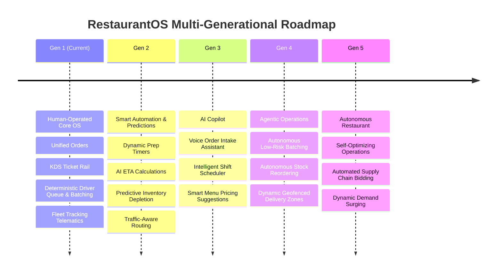

# RestaurantOS — Master System Implementation Roadmap

**Document ID:** `DOC-ROADMAP-001`  
**Version:** `1.1.0`  
**Status:** Approved Canonical Roadmap  

---

## 1. Multi-Generational Product Evolution Roadmap

---

## 2. Phase-by-Phase Development Lifecycle

### Phase 0: Master Initialization, Contract Alignment & Architecture (Current Phase)
- [x] Comprehensive repository audit and baseline assessment (`PROJECT_AUDIT.md`).
- [x] Master architecture blueprint with DDD bounded contexts (`ARCHITECTURE.md`).
- [x] Master product requirements document across all 44 core modules (`PRODUCT_REQUIREMENTS.md`).
- [x] Universal REST, explicit domain commands, ticket-based WebSocket, and SSE specs (`API.md`).
- [x] Canonical Master Domain Event Catalog (`EVENTS.md`).
- [x] Normalized multi-tenant PostgreSQL schema DDL across all 44 entities (`database/SCHEMA.md`).
- [x] Security architecture, RBAC hierarchy, and restricted driver DTO specs (`security/SECURITY_ARCHITECTURE.md`).
- [x] Testing strategy, automated test matrices, and manual checklist specifications (`testing/TESTING_STRATEGY.md`).
- [x] Deployment containerization, infrastructure, and CI/CD blueprints (`DEPLOYMENT.md`).
- [x] Operations, observability SLOs, and incident runbooks (`OPERATIONS.md`).
- [x] Integration Hub adapter specifications for Wolt, 10bis, Invoicing, Trackers, PBX (`INTEGRATIONS.md`).
- [x] Architecture Decision Records (ADRs 0001 through 0009).
- [x] Master Contract Alignment & Consistency Sign-off (`PHASE_0_CONTRACT_ALIGNMENT_REPORT.md`).

---

### Phase 1: Production Foundation (Next Implementation Phase)
- [ ] User authentication (session cookies, password reset, magic links, PIN auth).
- [ ] Multi-tenant hierarchy (Organization -> Restaurant -> Branch) with PostgreSQL RLS.
- [ ] Granular RBAC (12 core roles, 50+ permissions) and server-side authorization guards.
- [ ] Immutable audit logging subsystem (`audit_logs`).
- [ ] Typed event-driven subsystem with Transactional Outbox pattern (`outbox_events`).
- [ ] Pluggable notification abstraction (In-App, Email, SMS, WhatsApp).
- [ ] Multi-level feature flag evaluator.
- [ ] Phase 1 automated test suite & manual verification sign-off.

---

### Phase 2: CRM, Menu & Universal Orders
- [ ] Customer profile management, allergies, preferences, lifetime value metrics.
- [ ] Geocoded address intelligence (apartments, floor, entrance code, delivery notes).
- [ ] Hierarchical menu catalog (categories, products, variants, modifier groups).
- [ ] Universal Order Engine normalizer and independent finite state machine.
- [ ] Payment processing adapter integration (cash, card, split payments).

---

### Phase 3: Kitchen Display System (KDS) & Digital Ticket Rail
- [ ] Multi-station digital ticket rail (Grill, Salad, Fryer, Pizza, Expo).
- [ ] High-contrast SLA visual model (Green -> Amber -> Full Red Header with `+00:37` pulse).
- [ ] WebSocket real-time ticket streaming and offline reconnection recovery.
- [ ] Thermal paper printer fallback spooler.

---

### Phase 4: Delivery, Driver Queue, Fleet Tracking & Smart Batching
- [ ] Independent delivery state machine (`WAITING` $\rightarrow$ `DELIVERED`).
- [ ] Real-time Driver Availability Queue with deterministic FIFO ordering (`available_since ASC`).
- [ ] Atomic driver self-assignment with database row-level locking concurrency protection.
- [ ] Multidimensional driver status (Shift, Assignment, Trip) and distinct return events.
- [ ] Fleet domain models: `Vehicle`, `Tracker`, `DriverVehicleAssignment`, `VehicleTrackerAssignment`.
- [ ] IoT telematics integration (`ITrackerAdapter`, `MockTrackerAdapter`) and GPS location stream.
- [ ] Spatial geofencing events (`VehicleEnteredRestaurantGeofence`, `VehicleEnteredCustomerGeofence`).
- [ ] Deterministic Multi-Factor Smart Batching scoring engine with Manager Approval workflow.
- [ ] Supervised decision telemetry capture (`intelligence_decision_logs`).

---

### Phase 5: Inventory, Warehouse, Recipes (BOM) & Waste Tracking
- [ ] Multi-warehouse inventory tracking and unit-of-measure conversions.
- [ ] Configurable inventory depletion policies (`ON_ACCEPTED`, `ON_PREPARATION_START`, `ON_FULFILLMENT`).
- [ ] Recipe Bill of Materials (BOM) linking products/modifiers to ingredient grammages.
- [ ] Purchase order lifecycle and supplier catalog management.
- [ ] Kitchen waste logging and spoilage discrepancy analytics.

---

### Phase 6: Campaigns, Promotions & Customer Loyalty
- [ ] Marketing campaign dispatcher (SMS, WhatsApp, Email).
- [ ] Rule-based promotional engine (BOGO, combo discounts, happy hour schedules).
- [ ] Coupon validation and redemption tracking with usage caps.
- [ ] Tiered customer loyalty points engine (Bronze, Silver, Gold, Platinum).

---

### Phase 7: Telephony PBX Integration & Caller ID Popup
- [ ] SIP / WebRTC PBX webhook listener.
- [ ] Real-time Caller ID screen popup for phone intake operators.
- [ ] Fast customer lookup and 1-click previous order duplication.

---

### Phase 8: Integration Hub Adapters
- [ ] Wolt bi-directional order sync and status callback adapter.
- [ ] 10bis aggregator order ingestion adapter.
- [ ] Mishloha delivery integration adapter.
- [ ] Green Invoice (חשבונית ירוקה) digital tax invoice and receipt issuance adapter.
- [ ] Meshulam credit card clearance and tokenization adapter.
- [ ] Stripe international payment clearing adapter.

---

### Phase 9: Public Website Ordering & Self-Service Kiosk
- [ ] SEO-optimized responsive public web storefront (JSON-LD, Open Graph, Sitemap).
- [ ] Public customer checkout and live GPS order status tracking.
- [ ] Touchscreen self-ordering kiosk terminal with EMV payment terminal handshake.

---

### Phase 10: Analytics, Reporting & Financial Reconciliation
- [ ] Real-time executive sales dashboards and peak-hour heatmaps.
- [ ] End-of-Day (EOD) Z-reports and cash drawer reconciliation.
- [ ] COGS (Cost of Goods Sold) food cost variance reports.

---

### Phase 11: Security Hardening & Penetration Testing
- [ ] OWASP Top 10 automated vulnerability scanning and remediation.
- [ ] Rate limiting enforcement and brute-force mitigation.
- [ ] Cryptographic webhook verification and token replay defense.

---

### Phase 12: Complete QA, Load Simulation & Accessibility Sign-off
- [ ] 500 req/sec load testing and WebSocket latency verification.
- [ ] Cross-browser / cross-device viewport test matrices (Mobile, Tablet, Desktop, Android TV).
- [ ] Full WCAG 2.1 AA accessibility audit.

---

### Phase 13: Production DevOps, CI/CD & Infrastructure
- [ ] Multi-stage production Docker container builds.
- [ ] Kubernetes Helm charts and multi-region cloud deployment.
- [ ] Automated GitHub Actions CI/CD pipelines with rollback automation.

---

### Phase 14: Final Production Audit & Operational Sign-off
- [ ] End-to-end production readiness review.
- [ ] SLA and Disaster Recovery verification.
- [ ] Final architecture signoff.
