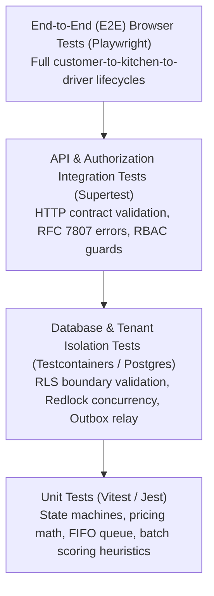

# RestaurantOS — Master Testing Policy & Quality Assurance Standards

**Document ID:** `DOC-TEST-001`  
**Version:** `1.0.0`  
**Status:** Approved  
**Coverage Standard:** Minimum 85% overall codebase; 100% for Security, State Machines & Financial Logic  

---

## 1. Quality Assurance Philosophy

In high-pace restaurant environments, software bugs directly cause kitchen chaos, lost revenue, delayed customer food, and driver confusion. Consequently, RestaurantOS enforces a strict **Zero-Regression / Evidence-Based Testing Standard**.

**Rule:** No feature or bug fix may be merged to the main branch without automated tests and a documented manual verification checklist.

---

## 2. The RestaurantOS Testing Pyramid

---

## 3. Automated Test Categories & Tooling

| Test Tier | Tool / Framework | Target Scope | Execution Frequency |
| :--- | :--- | :--- | :--- |
| **Unit Tests** | Vitest / Jest | Domain entities, state machines, modifier calculations, smart batching heuristics, FIFO queue ordering. | On every code change (sub-second local feedback). |
| **Database & RLS Tests**| Vitest + Docker Postgres | Tenant isolation boundary proofs, atomic conditional updates, database constraints, migrations. | Pre-commit & CI pipeline. |
| **API Contract Tests** | Supertest / Fastify Inject | REST endpoints, WebSocket connections, input validation schemas (Zod), RBAC permission guards. | CI Pull Request gate. |
| **Concurrency Tests** | Custom Worker Harness | High-contention race conditions (e.g. 50 drivers attempting to self-assign the same delivery simultaneously). | CI Pull Request gate. |
| **End-to-End (E2E)** | Playwright | Full browser flows across Desktop, Tablet (KDS), and Mobile (Driver/Web Ordering) viewport matrices. | Nightly & Pre-release CI. |
| **Performance / Load** | k6 | 500 req/sec peak lunch hour simulation, WebSocket KDS broadcast latency under 200 concurrent screens. | Staging environment pre-release. |

---

## 4. Definition of Done (DoD) for Any Pull Request

Before marking any module or phase complete, the following criteria must be satisfied:

1. 100% automated test pass rate with zero flaky tests.
2. Code coverage requirements met:
   - Auth, RBAC & Tenant Isolation: `100%`
   - Order & Delivery State Machines: `100%`
   - Pricing, Discounts & Invoice Calculations: `100%`
   - Core API Controllers & Handlers: `≥ 90%`
   - Overall Application: `≥ 85%`
3. TypeScript compiler passes with `strict: true` and zero `any` types.
4. Linter and formatting pass cleanly (`eslint`, `prettier`).
5. Manual test checklist documented and executed on staging hardware.
6. Security and audit logging verified.
7. Documentation updated in `/docs` and roadmap checked.
