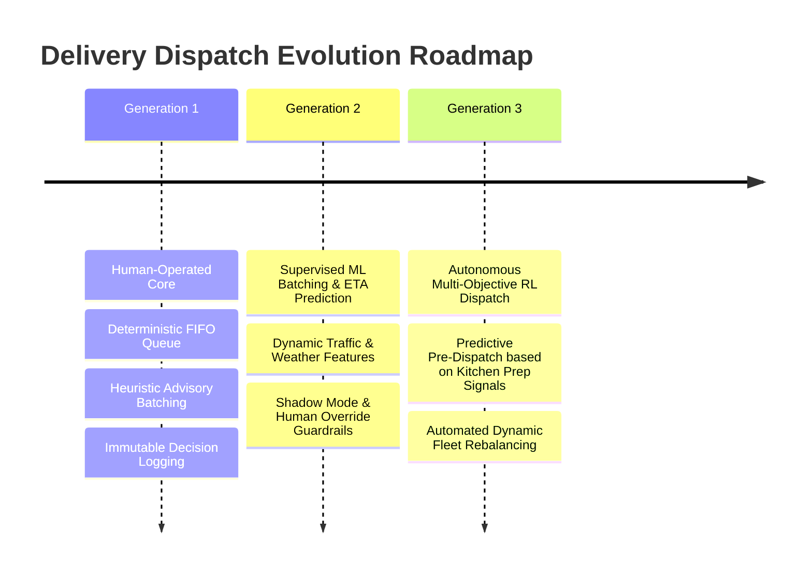

# Delivery AI & ML Evolutionary Roadmap

## 1. Multi-Generation Evolution Architecture

---

## 2. Phase Breakdown

### Generation 1 (Current State - Phase 4)
- **Control:** 100% human-operated.
- **Scoring:** Deterministic geometric & heuristic formula.
- **Role of Intelligence:** Advisory batch recommendations with manual manager approval (`APPROVE` / `REJECT`).
- **Telemetry Axiom:** Telemetry is advisory; Geofence triggers `ARRIVED_AT_CUSTOMER_AREA`, never auto-`DELIVERED`.
- **Infrastructure:** Decision logging schema (`intelligence_decision_logs`) capturing features, proposals, manager actions, and final outcomes.

### Generation 2 (Supervised ML & Predictive Dispatch)
- **Control:** Hybrid dispatch with human supervision and emergency pause.
- **Models:** Gradient Boosted Trees (XGBoost/LightGBM) trained on historical `intelligence_decision_logs`.
- **Features:** Real-time traffic APIs, weather conditions, historical prep times, driver speed profiles.
- **Execution Mode:** Shadow evaluation alongside Generation 1 heuristic, comparing accuracy and manager approval rate.

### Generation 3 (Autonomous Multi-Objective Reinforcement Learning)
- **Control:** Autonomous dispatch for verified standard operating conditions.
- **Models:** Deep Reinforcement Learning for Vehicle Routing Problem with Time Windows (VRPTW).
- **Features:** Pre-dispatch optimization (assigning driver before kitchen finishes preparation based on exact cook-stage completion prediction).
- **Guardrails:** Hard SLA constraint validators, supervisor intervention controls, automated anomaly triggers.
