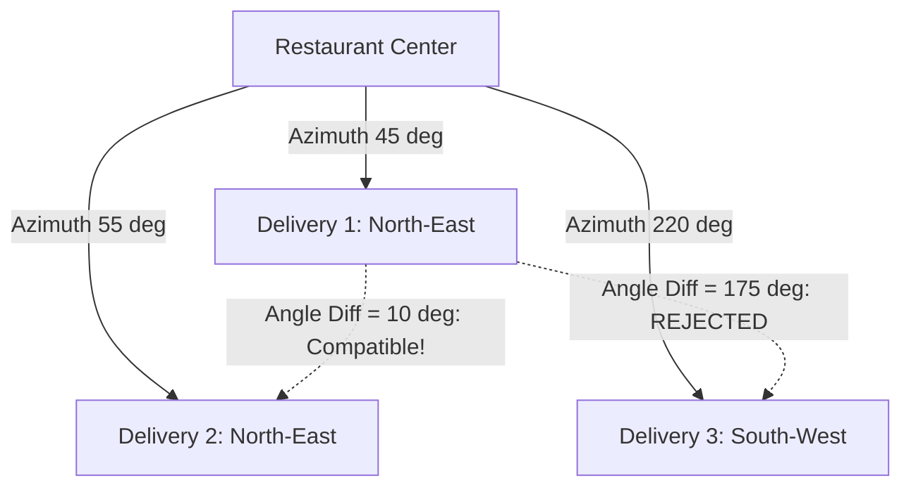

# Smart Batching Engine (Generation 1 Heuristic)

## 1. Advisory Model Philosophy

In RestaurantOS Generation 1, smart batching is strictly **advisory**:
- The system generates intelligent batch proposals scored by deterministic multi-factor formulas.
- Batches require human manager intervention (`APPROVE`, `REJECT`, `MODIFY`, or `FORCE`).
- Autonomous dispatch without human approval is deferred to Generation 2 ML automation.

---

## 2. Multi-Factor Batch Scoring Formula

The heuristic batching algorithm calculates a composite score $S \in [0, 100]$:

$$S = w_1 \cdot D + w_2 \cdot \Theta + w_3 \cdot K + w_4 \cdot L + w_5 \cdot C$$

Where:
- **Distance Factor ($D \in [0, 100]$):** Proximity between delivery locations ($D = \max(0, 100 - \frac{\text{dist}}{5000} \cdot 100)$).
- **Azimuth Alignment ($\Theta \in [0, 100]$):** Angle difference $\Delta\theta$ from restaurant reference point ($\Theta = \max(0, 100 - \frac{\Delta\theta}{90} \cdot 100)$). If $\Delta\theta > 90^\circ$, score is 0.
- **Kitchen Synchronization ($K \in [0, 100]$):** Readiness timing and thermal packaging synchronization.
- **SLA Headroom ($L \in [0, 100]$):** Promise time slack vs estimated route duration.
- **Vehicle Capacity ($C \in [0, 100]$):** Volume/weight constraints against vehicle profile (e.g. Scooter = 2-3 bags, Car = 6-8 bags).

### Default Weights (Gen 1)
- $w_1 = 0.30$ (Distance)
- $w_2 = 0.35$ (Directional Azimuth)
- $w_3 = 0.15$ (Kitchen Readiness)
- $w_4 = 0.10$ (SLA Headroom)
- $w_5 = 0.10$ (Vehicle Capacity)

Threshold: Only batch combinations with $S \ge 60.0$ are suggested to dispatch managers.

---

## 3. Directional Azimuth & Route Divergence Prevention

- **Compatible Routes:** Small angular spread ($\Delta\theta \le 30^\circ$) yields high direction score.
- **Diverging Routes:** Batches requiring drivers to travel in opposite directions ($\Delta\theta > 90^\circ$) are strictly filtered out to prevent SLA violations and cold food delivery.
