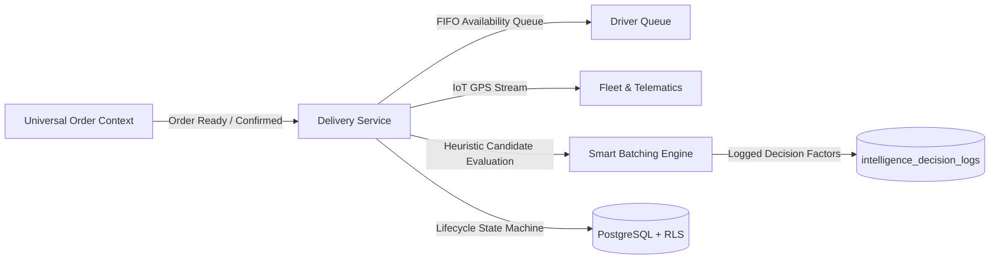
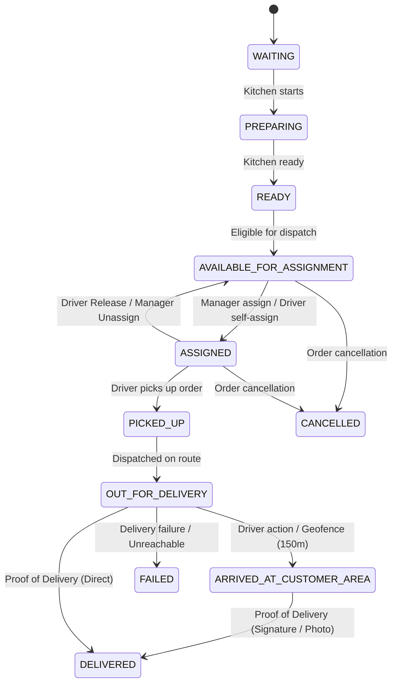

# Delivery & Logistics Architecture (Phase 4)

## 1. Domain Separation & Decoupling

In RestaurantOS, Delivery & Logistics operates as a distinct bounded context completely decoupled from Universal Orders:
- The **Universal Order** manages the customer contract, catalog line items, pricing, modifications, payment settlement, and overall status (`PENDING` $\rightarrow$ `CONFIRMED` $\rightarrow$ `IN_PREPARATION` $\rightarrow$ `READY_FOR_PICKUP` $\rightarrow$ `COMPLETED`).
- The **Delivery** entity manages the physical dispatch, route assignment, vehicle tracking, driver availability queue, proof of delivery, and field exceptions.

---

## 2. Delivery State Machine

A delivery progresses through deterministic, verifiable states:

---

## 3. Driver Multidimensional State Model

Drivers have a 3-dimensional state representation preventing state ambiguity:
1. **`shift_status`**: `OFF_SHIFT` | `ON_SHIFT` | `BREAK`
2. **`assignment_status`**: `AVAILABLE` | `ASSIGNED`
3. **`trip_status`**: `NOT_STARTED` | `IN_TRANSIT` | `AT_CUSTOMER` | `RETURNING`

### FIFO Queue Invariants
- Queue eligibility requires: `shift_status = 'ON_SHIFT'` AND `assignment_status = 'AVAILABLE'` AND `is_active = true`.
- Ordered strictly by `available_since ASC`, with `user_id ASC` as deterministic tie-breaker.
- **Return Disambiguation:**
  - `POST /drivers/me/return-from-break`: Emits `DriverReturnedFromBreak`, resets `available_since = NOW()`.
  - `POST /drivers/me/arrived-at-restaurant`: Emits `DriverReturnedToRestaurant`, resets `available_since = NOW()`.

---

## 4. Fleet & Telematics Rules

### The Core Telemetry Axiom
$$\text{Telemetry} \neq \text{Business Truth}$$

- When a vehicle GPS location falls within 150m of a customer's destination, the delivery advances to `ARRIVED_AT_CUSTOMER_AREA`.
- Physical GPS proximity **never** automatically transitions the delivery to `DELIVERED`.
- In Generation 1, final delivery completion requires explicit human confirmation (driver input + signature/photo proof).

---

## 5. Data Minimization (`DeliveryViewDTO`)

To safeguard customer privacy, drivers never receive direct database models containing payment details, card tokens, or internal order accounting. The driver client receives a strict projection (`DeliveryViewDTO`):
- Delivery address, entrance, floor, apartment, gate code, parking notes.
- Delivery notes and driver instructions.
- Associated timestamps and status.
