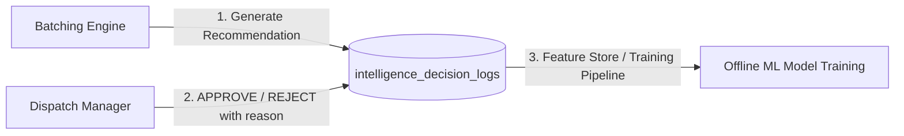

# Gen 1 Intelligence & Decision Learning System

## 1. Ground Truth Collection for Future ML

Every proposal generated by the Smart Batching Engine and every human manager decision is immutably recorded in `intelligence_decision_logs`. This establishes high-quality labeled training datasets for future machine learning models.

---

## 2. Decision Log Schema

Each log entry captures:
- **`tenant_id` & `branch_id`**: Multi-tenant isolation context.
- **`decision_type`**: `DELIVERY_BATCH_RECOMMENDATION` | `DISPATCH_ASSIGNMENT` | `ETA_PREDICTION`.
- **`candidate_delivery_ids`**: Deliveries evaluated in the proposal.
- **`candidate_driver_ids`**: Eligible drivers at proposal time.
- **`recommendation`**: The exact recommendation payload and suggested batch ID.
- **`scoring_breakdown`**: Computed sub-scores (distance, azimuth, kitchen sync, SLA, capacity).
- **`manager_action`**: `APPROVED` | `REJECTED` | `MODIFIED` | `OVERRIDDEN`.
- **`actor_id`**: The human manager who made the decision.
- **`rejection_reason`**: Structured or textual explanation if rejected (e.g., "separate thermal bags", "traffic bottleneck on bridge").
- **`outcome`**: Downstream delivery completion data (actual delivery time, transit duration, SLA met).

---

## 3. Human Feedback Loop & Model Retraining

By capturing explicit rejection reasons (e.g. "Customer requested delivery after 20:00", "Large pizza boxes require car trunk"), offline training jobs can learn nuanced non-linear constraints that simple geometric distance calculations cannot capture.
