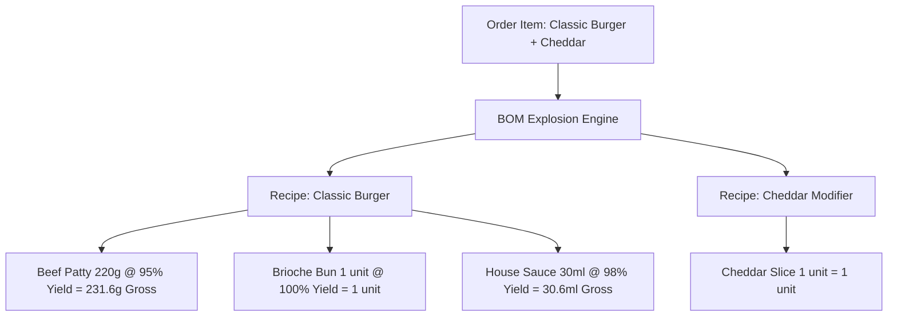

# RestaurantOS — Bill of Materials (BOM) & Recipe Explosion Engine

## 1. Recipe Hierarchy & Data Model
Every catalog product, variant, and modifier option can be associated with a recipe. Recipes contain one or more `recipe_items` referencing raw ingredients or nested sub-recipes.

## 2. Yield Factor & Loss Percentage Formula
Raw ingredients experience preparation or cooking losses (e.g. fat rendering in burger patties, potato peeling waste in fries).
The gross ingredient required to produce net recipe quantity is computed as:

$$\text{Gross Required Quantity} = \frac{\text{Net Recipe Quantity} \times \text{Portion Multiplier}}{\left(\frac{\text{Yield Percentage}}{100}\right)}$$

### Example (Classic Burger Patty):
- Net meat portion: $220\text{g}$
- Cooking / trimming yield: $95\%$
- Required raw beef: $\frac{220}{0.95} \approx 231.58\text{g}$
- Cost per gram: $₪0.075$
- Theoretical ingredient cost: $231.58 \times 0.075 = ₪17.37$

## 3. Theoretical Food Cost & Profit Margin
Theoretical food cost is the sum of gross costs across all exploded ingredients and modifiers:

$$\text{Theoretical Food Cost} = \sum (\text{Gross Quantity}_i \times \text{Unit Cost}_i)$$
$$\text{Theoretical Food Cost \%} = \frac{\text{Theoretical Food Cost}}{\text{Product Retail Selling Price}} \times 100$$
