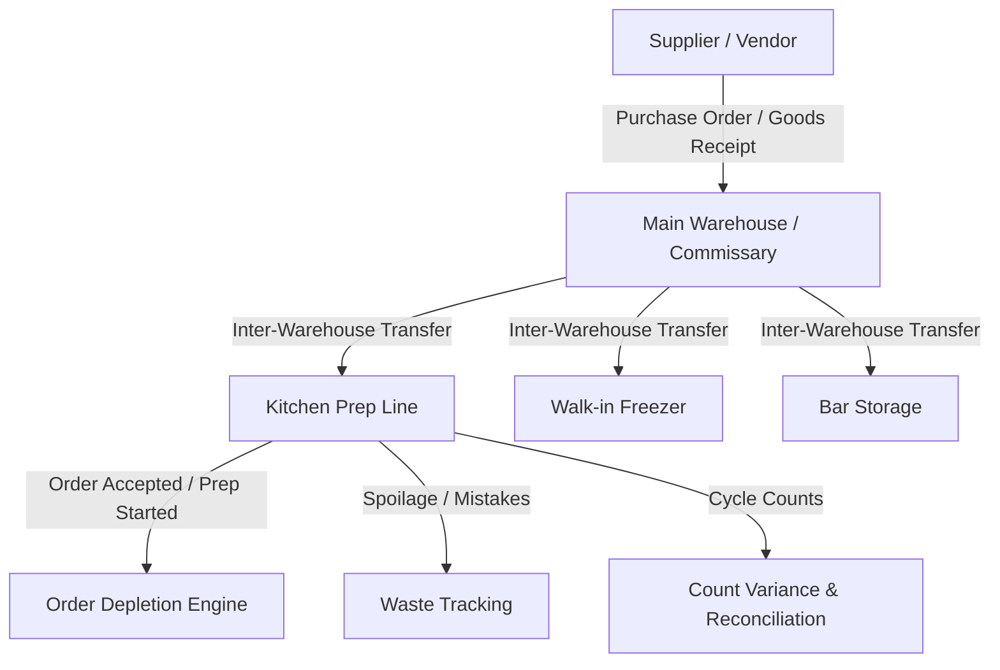

# RestaurantOS — Phase 5: Inventory & Supply Chain Architecture

## 1. Overview & Multi-Warehouse Hierarchy
Phase 5 implements the multi-warehouse inventory engine, recipe/BOM explosion system, configurable stock depletion policies, and waste tracking as specified in `PHASE 00.md` (Section 34) and `RestaurantOS — 05 Inventory Warehouse Recipes.md`.

## 2. Core Entities
1. **Units of Measure & Conversions (`units_of_measure`, `unit_conversions`)**:
   - Supports dimensional conversions (`WEIGHT`, `VOLUME`, `UNIT`, `LENGTH`).
   - Base units: $g \leftrightarrow kg$, $ml \leftrightarrow l$.
   - Density-based custom conversions for ingredients.
2. **Ingredients (`ingredients`)**:
   - Master raw goods catalogue with SKU, unit of measure, standard cost per unit, and allergen declarations.
   - Low stock thresholds: `minimum_stock_level` (critical red alert) and `reorder_point` (reorder warning).
3. **Warehouses & Storage Locations (`warehouses`, `storage_locations`)**:
   - Distinct storage facilities: `MAIN_WAREHOUSE`, `KITCHEN`, `WALK_IN_FREEZER`, `DRY_STORAGE`, `BAR`, `COMMISSARY`.
4. **Inventory Stocks (`inventory_stocks`)**:
   - Balance tracking per warehouse + ingredient: `quantity`, `reserved_quantity`, `available_quantity`.
5. **Stock Movements (`stock_movements`)**:
   - Append-only audit trail with `movement_type` (`PURCHASE_RECEIPT`, `SALE_DEPLETION`, `SALE_ROLLBACK`, `TRANSFER_IN`, `TRANSFER_OUT`, `WASTE`, `COUNT_ADJUSTMENT`).
   - Idempotency key protection prevents duplicate movements.
6. **Suppliers & Purchase Orders (`suppliers`, `supplier_items`, `purchase_orders`, `goods_receipts`)**:
   - Direct procurement workflows, PO status transitions (`DRAFT` $\rightarrow$ `SUBMITTED` $\rightarrow$ `PARTIALLY_RECEIVED` $\rightarrow$ `RECEIVED` $\rightarrow$ `CANCELLED`), and idempotent goods receiving.
7. **Transfers (`inventory_transfers`, `inventory_transfer_items`)**:
   - Inter-warehouse transfer lifecycle (`REQUESTED` $\rightarrow$ `APPROVED` $\rightarrow$ `IN_TRANSIT` $\rightarrow$ `COMPLETED`).
8. **Waste Records (`waste_records`)**:
   - Granular reason codes (`EXPIRED`, `SPOILED`, `PREP_MISTAKE`, `DROPPED`, `SPILLAGE`, `THEFT`, `SAMPLE`) and automatic cost impact computation.
9. **Physical Counts & Reconciliation (`inventory_counts`, `inventory_count_items`)**:
   - Physical count recording, theoretical vs physical variance detection, financial discrepancy calculation, and reconciliation stock adjustment.
