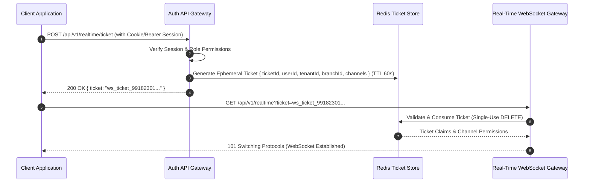

# RestaurantOS — Technical Security Architecture

**Document ID:** `DOC-SEC-ARCH-001`  
**Version:** `1.1.0`  
**Status:** Approved Canonical Security Architecture  

---

## 1. Authentication & WebSocket Ticket Handshake

To prevent exposing long-lived session credentials or JWTs in query parameters and HTTP access logs, RestaurantOS uses a **Two-Step Ticketed WebSocket Handshake**:



---

## 2. Real-Time Channel Authorization Boundaries

Every WebSocket and SSE subscription is gated by strict channel authorization rules:

| Channel Scope | Authorized Roles | Permitted Payload Fields | Forbidden Payload Fields |
| :--- | :--- | :--- | :--- |
| `branch:<id>:kds:<station>` | `LINE_COOK`, `KITCHEN_MANAGER` | Ticket ID, station items, modifiers, prep notes, timer. | Customer names, phone numbers, addresses, payment totals. |
| `branch:<id>:dispatch` | `DISPATCH_MANAGER`, `GENERAL_MANAGER` | Orders, driver queue, batch suggestions, SLA status. | Plaintext passwords, raw credit card tokens. |
| `driver:<id>:deliveries` | Authenticated `DRIVER` | `DeliveryViewDTO` (assigned delivery address, notes). | Other drivers' data, CRM order history, customer LTV. |
| `order:<id>:tracking` | Public (Token-Gated) | Delivery status, order progress, estimated arrival time. | Driver phone number, vehicle telemetry, kitchen tickets. |
| `branch:<id>:telemetry` | `FLEET_MANAGER`, `ADMIN` | Vehicle location coordinates, speed, tracker battery. | Customer CRM profiles, payment details. |

---

## 3. Driver Least-Privilege Data Minimization (`DeliveryViewDTO`)

Delivery drivers do not have access to full customer profiles. Drivers receive a strictly minimized data contract:

```typescript
export interface DeliveryViewDTO {
  deliveryId: string;
  orderNumber: string;
  destination: {
    street: string;
    houseNumber: string;
    entrance?: string;
    floor?: string;
    apartment?: string;
    gateCode?: string;
    parkingInstructions?: string;
    deliveryNotes?: string;
    location: { lat: number; lng: number };
  };
  customerContact: {
    displayName: string;
    maskedPhone: string; // Relayed through telephony proxy
  };
  deliveryStatus: DeliveryStatus;
  itemsSummary: { name: string; quantity: number }[];
  isPaid: boolean;
  amountToCollectOnDelivery: number; // 0.00 if already paid online
}
```

---

## 4. Multi-Tenant Cross-Referencing Integrity Rules

To prevent cross-tenant data corruption or IDOR tampering:
1. **Composite Foreign Key Assertions:** Entities referencing parent tenants enforce `tenant_id` alignment at both database and application query boundaries.
2. **Negative Boundary Validation:** If a request in Tenant A attempts to link a Vehicle or Driver belonging to Tenant B, the API immediately halts with `403 Forbidden (TENANT_BOUNDARY_VIOLATION)`.
3. **Database RLS Policies:** Row-Level Security ensures that even in the presence of SQL injection, no cross-tenant rows can ever be selected or mutated.

---

## 5. Telephony Security & Israeli Wiretap Law Compliance (Phase 7)

### 5.1 Israeli Regulatory Greeting & Recording Requirements
Under Israeli Wiretap Law (חוק האזנת סתר, התשל"ט-1979) and privacy guidelines:
1. **Automated Greeting Requirement:** Parties do not need a signed consent form, but callers must be informed via a pre-loaded automated recording played in the first seconds of the call that the conversation may be recorded for service quality assurance.
2. **System Enforcement:** The telephony module automatically tracks `automated_greeting_played: true` when ingesting or bridging inbound calls.
3. **Webhook Authentication:** Vendor webhooks from PBX/SIP trunks must provide valid cryptographic signatures (`x-telephony-token` or HMAC signature) matching the tenant PBX trunk configuration.
4. **Idempotent Ingestion:** Incoming call sessions enforce unique constraints on `(tenant_id, call_session_id)` to prevent replay attacks or duplicate popups.

